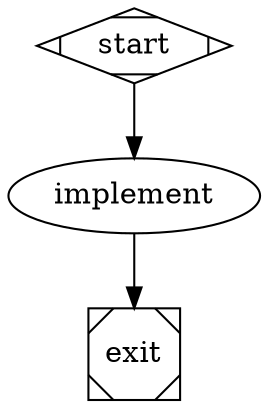

# The Fabro dialect, as lowered

Petri runs Fabro workflows: Graphviz DOT files (`*.fabro`, `*.dot`) in the
subset Fabro accepts. This page says what each Fabro construct becomes in the
engine's IR, and what is refused. Fabro's own documentation defines the
language; `.ai/plans/done/fabro-frontend-phase-one.md` records the decisions.
The reference Fabro revision, the required workflow bundles, the feature
matrix, and the accepted differences are frozen in
[`crates/fabro/acceptance/CONTRACT.md`](acceptance/CONTRACT.md).

The rule throughout: **every construct lowers onto what the core has**. No
engine semantics were added for Fabro. A construct that cannot lower is a
specific `unsupported.*` rejection, never a silent approximation.

What a host that embeds Petri relies on (interfaces, identities, event
positions, acknowledgements, versions) and what stays Fabro's platform's is
[`crates/fabro/HANDOFF.md`](HANDOFF.md). The public events every construct
below produces, and the projection tests that prove them, are the
event-coverage matrix in `crates/core/execution/EVENTS.md`.

## Run creation happens at load

Fabro renders templates, resolves `@file` references and applies its model
stylesheet once, when a run is created, and persists the literal graph. The
frontend does the same at load, so `petri check --print-graph` shows the graph
a run will execute.

| Fabro | At load |
|---|---|
| `{{ inputs.* }}`, `{{ vars.* }}`, `{{ goal }}` in the goal and prompts | rendered with MiniJinja, strict: an unbound name is `unsupported.template.unbound_input` with the `--input KEY=VALUE` hint. `petri check` given no inputs at all downgrades it to the warning `fabro.unbound_input` and leaves the text unrendered, so a file validates before its inputs exist; a run is always strict |
| the same tokens in a `script` | Fabro's token interpolation: each token is one shell-quoted word |
| `[run.inputs]` in `workflow.toml` beside the file | input defaults, under the host's `--input` / `--inputs-file` |
| `[run] goal` (text or `{ file }`) | the run goal when the graph sets no `goal` (the graph attribute wins, as in Fabro) |
| `[run.model]` `provider`, `name`, `controls.reasoning_effort`, `controls.speed` | the model, provider, reasoning effort and speed an agent or prompt node gets when neither it nor the graph (`default_model`, `default_provider`) names one. Below every file layer sits the launch: `petri run --model`, `--provider` (bound as the `petri.launch_model` and `petri.launch_provider` compile variables) fill the name and provider nothing else set, and a provider alone runs its default model from the runner's catalog, as `fabro run --provider` does. The pinned Fabro puts its launch layer above `workflow.toml`; Petri keeps the file layers in charge and uses the launch only as the last default |
| `[run.model.fallbacks]` `"<model>" = ["provider:model", ...]` | Fabro's model-keyed fallback chains ("Model fallback" under "Native Pebble" below). The frontend checks the shape (a table keyed by a requested model; each entry a bare token, `provider:selector`, or the legacy `provider/selector`; a provider-qualified key is refused as Fabro refuses it, `fabro.model_fallbacks`) and puts the chains on every agent and prompt node config under `fallbacks`; the runner resolves them against its catalog at the first LLM stage |
| `[run.execution]` `mode`, `approval` | launch defaults in `Graph.params["fabro.launch"]`: `mode = "dry_run"` runs the stub registry, `approval = "auto"` answers every question with its first choice. `--dry-run`, `--auto-approve`, `--interactive` and `--interview-script` win |
| `[run.clone]` `enabled`, `depth` | the server clones the repository into the sandbox before the first stage | the root `start` stage checks the repository out into its workspace before anything runs there: a clone of the repository the run was loaded from (`--repo`, else the bundle root above the workflow file; the runtime binds it as the `petri.repository` compile variable, absolute) at `depth` commits (Fabro's default 100; `0` is the full history), packed on the host and delivered through the scope's executor to the environment's own `tar`, so a Docker workspace receives the same files as a host one. The clone's `origin` is the repository's own `origin` when it has one; nothing is fetched. `enabled = false` starts from an empty workspace. A file outside a Git work tree, or a host that lowers in memory without binding the variable, also starts empty, with a `checkout:` log line saying so. The launch parameter carries `clone` (`enabled`, `depth`, `repository`); a delivered checkout logs `checkout: <root> at <commit> (depth N)` and emits a `fabro.checkout` `StepEvent::Custom` (`repository`, `commit`, `depth`, `files`) |
| `[run.model]` in `.fabro/project.toml` and the host's user settings layer | the three layers combine, settings under project under workflow | the same order: a `[run.model]` key `workflow.toml` leaves unset is filled from `.fabro/project.toml`, then from the settings layer (`fabro.settings_toml`, which `petri` binds from `$FABRO_HOME/settings.toml`, else `~/.fabro/settings.toml`). This is how a workflow that names no model, such as the pinned interview workflow, gets the operator's default |
| `[run.environment]` `id` over `[environments.<id>]` | `provider` selects the sandbox backend when `--backend` is not given: `local` is the host, `docker` the Docker plugin, `daytona` the Daytona plugin. `image.docker` becomes the scope's container image under `docker` and `daytona`. `env` is the scope environment; a value that is exactly `{{ secrets.NAME }}` is a `$secret` reference every command resolves at spawn (the standalone runner reads `PETRI_SECRET_NAME`; a missing secret fails the command with `secret_unavailable`) and masks in every log. `resources` size a Daytona runner. `cwd`, `network`, `lifecycle`, `labels` and `image.dockerfile` are platform-only and warn `ignored.workflow_toml.environments.<id>.<key>`; an `id` with no table, or a provider outside the three, is an error |
| `[run.prepare]` `steps`, `timeout` | setup steps lowered as command nodes `run_prepare_1`, `run_prepare_2`, ... between `start` and its successors, so they run in the selected environment before any node, in order, each with the section's `timeout` (default `5m`), its `env`, and `on_failure="exit"`: a failed step ends the run before the first node. `command` argv is joined with shell quoting; `script` runs as written; `{{ inputs.* }}`, `{{ vars.* }}` and `{{ goal }}` render at load. The whole file is validated before any step runs |
| `[[run.hooks]]` in `workflow.toml`, `.fabro/project.toml` at the repository root, and the host's user settings layer | local hooks ("Hooks" below). Each layer is read on its own and the three merge as Fabro's `combine_hooks` does: settings, then project, then workflow, a higher layer's entry replacing a lower one with the same `id` in place and the rest appending. Every field is validated at load (`fabro.hooks.toml`, `.entry`, `.event`, `.transport`, `.timeout`, `.matcher`); a hooks layer that cannot be read is an error, so a configured hook is never skipped silently. A `checkpoint_saved` hook warns `fabro.hooks.checkpoint_saved` and never runs. The merged list lands in `Graph.params["fabro_hooks"]` and on the `start` and `exit` stages. The user layer (`~/.fabro/settings.toml`) is outside the repository, so the host passes its text as the `fabro.settings_toml` compile variable when it wants one |
| `[run.agent.mcps.<name>]` in `workflow.toml`, `.fabro/project.toml` and the host's user settings layer | MCP servers for native agent nodes ("MCP servers" under "Native Pebble" below). Each layer is read on its own with Fabro's field rules (`type` is `stdio`, `http` or `sandbox`; exactly one of `script` and `command`; `url`; `port`; `protocol` on `http` and `sandbox`, `streamable_http` by default or `sse`; `env`, `headers`; `startup_timeout` default `10s`, `tool_timeout` default `60s`; `enabled`), the three merge by name with the higher layer replacing the lower one whole (Fabro's sticky map) and `enabled = false` removing the name, and the merged list is carried on every agent node's config (`mcps`) and into nested workflows. `{{ inputs.* }}`, `{{ vars.* }}` and `{{ goal }}` substitute at load; a value under `env` or `headers` that is exactly `{{ secrets.NAME }}` is a `$secret` reference resolved when the server launches. Errors: `fabro.mcps.entry`, `fabro.mcps.type`, `fabro.mcps.shape`, `fabro.mcps.toml` (a layer that names servers and does not parse), `fabro.mcps.unbound`, `fabro.mcps.env_token` (`{{ env.* }}`, refused as Fabro refuses it); `unsupported.workflow_toml.run.agent.mcps.reference` (`id = ...` names a server-managed catalog the standalone runner does not have), `unsupported.workflow_toml.run.agent.mcps.secret` (a secret token anywhere but a whole `env` or `headers` value) |
| other sections in `workflow.toml` | every section is diagnosed, none is dropped silently. Platform-only sections warn `ignored.workflow_toml.<section>` with why (`[run.working_dir]`, `[run.metadata]`, `[run.run_branch]`, `[run.meta_branch]`, `[run.pull_request]`, `[run.git]`, `[run.integrations]`, `[run.checkpoint]`, `[run.artifacts]`, `[run.notifications]`, `[run.interviews]`, `[run.scm]`, `[run.agent] fabro_tools`, and the top-level `[project]`, `[cli]`, `[server]`, `[llm]`). A requirement the standalone runner cannot meet is a specific `unsupported.workflow_toml.*` error (the MCP row above lists its three). A key Fabro's parser refuses (a legacy top-level key, an unknown `[run]` key, `_version` other than 1) is `unsupported.workflow_toml.key` / `unsupported.workflow_toml.version` with Fabro's rename hint. See `crates/fabro/acceptance/CONTRACT.md` for the per-option table |
| `prompt="@prompts/x.md"`, `output_schema="@schemas/x.json"` | read beside the workflow file; `` resolves beside the included file |
| `model_stylesheet` | rendered, parsed (`*`, shape, `.class`, `#id`; specificity 0–3), written onto nodes; an explicit node attribute wins |
| `import="<path>"` | expanded at load as Fabro's import transform expands it (below); the persisted graph carries the imported nodes |

Inputs, vars and the rendered goal land in `Graph.params` (`inputs`, `vars`,
`goal`), so the persisted graph is self-describing for replay. The launch
settings `workflow.toml` declared land in `Graph.params["fabro.launch"]`
(`sandbox_backend`, `dry_run`, `auto_approve`, the Daytona sizes), beside the
launch-level model default as the host gave it (`model`, `provider`; `null`
when the launch named none), and the resolved environment in
`Graph.params["fabro.environment"]`; the CLI reads them back through
`Frontend::launch_settings` when it starts the run.

## Imports

A node with `import="<path>"` is a placeholder for another workflow file,
resolved relative to the importing file. The imported file's nodes are
spliced in under the placeholder's id as a prefix (`<placeholder>.<node>`);
its start and exit sentinels (`Mdiamond`/`Msquare`, or the ids `start`,
`exit`, `end`) are dropped; the placeholder's incoming edges reach the
imported entry node and its outgoing edges leave the imported exit
predecessor, both with their attributes. The placeholder may carry only
`import`, `class`, and the inheritable defaults `model`, `provider`,
`reasoning_effort`, `speed`, `backend`, `acp.command`, `acp.config`,
`fidelity`, `max_retries`, `thread_id`; each default lands on every imported
node that does not set it. The placeholder's classes and a class made from its
id (lowercase, spaces to `-`, `[a-z0-9-]` only) propagate to every imported
node. `retry_target` and `fallback_retry_target` inside the import are rewritten
to the prefixed ids; `@file` references inside it resolve beside the imported
file. Imports nest, each relative to its own file; a cycle is refused.

Fabro's boundary rules apply and every failure is `fabro.import` on the
placeholder with Fabro's message: exactly one start and one exit; no edge into
start or out of exit; exactly one successor of start and one predecessor of
exit, neither edge carrying `condition`, `label`, `weight`, `fidelity`,
`thread_id`, `loop_restart` or `freeform`; an empty import (start to exit
only) is removed and its neighbours wired directly, but not across a semantic
edge; a placeholder with any other attribute, a self-loop, or a prefixed id
that already exists is refused. An imported `model_stylesheet` is ignored with
a warning; the importing workflow's stylesheet governs.

## Nodes

| Shape / type | Petri node | Step config |
|---|---|---|
| `Mdiamond` start | `fabro/stage`, the entry | `kind = "start"`, the workflow name, the merged hooks |
| `Msquare` exit | `fabro/stage`; `Completion::TerminalNode(exit)` | `kind = "exit"`, the workflow name, the merged hooks |
| `diamond` conditional | `noop` | |
| `box` agent | `fabro/agent` | prompt, goal, `fidelity` and `default_fidelity`, `thread_id`, `default_thread` and the node's classes, `project_memory`, `backend`, model settings (`model`, `provider`, `reasoning_effort`, `speed`, `max_tokens`), `output_schema`, `output_retries`, `acp`, `mcps` (the run's MCP servers), the workflow's stage list for the preamble |
| `tab` prompt | `fabro/prompt` | prompt, goal, `fidelity` and the thread attributes (accepted; a prompt node never continues a conversation), `project_memory`, model settings (`model`, `provider`, `reasoning_effort`, `speed`, `max_tokens`), `output_schema`, `output_retries`; API-only: `backend="acp"` on the node is `fabro.prompt_backend`, and the graph's ACP settings never reach it |
| `parallelogram` command, or any node with `script` | `fabro/command` | script, language, `stdin` (an expression over `kv`), `output_schema`, `env` (`[run.prepare]` step env and the environment's `$secret` values) |
| `hexagon` human | `fabro/human` | the choices (from the edges), `question_type`, `freeform_target`, `sensitive`, `review_target`, `default_choice` (from `human.default_choice`), `timeout_ms` |
| `component` parallel | `fabro/fork`: takes the fork snapshot of `kv` (and of the stage records for agent or prompt targets) once per visit, offloads the `for_each` source list and every other value above 4 KiB to the output store, and outputs `{ snapshot, nodes }`; each branch target becomes a synthetic `fabro/branch` delegate (`kind = "parallel.branch"`) that runs a copy of the target in a child invocation from that snapshot; `for_each` marks the delegate `Expansion::ForEach` (below) | fork: `label`, `node`, `kv`, `nodes`, `source`, `inline`; branch: `label`, `node`, `fork`, `index`, `item`, `for_each`, `max_parallel`, `child_digest`, `target_kind`, `kv`, `nodes`, `generation` |
| `tripleoctagon` fan-in | `fabro/fan_in`, `join: all`; publishes `parallel.results` and `parallel.branch_count`; its output is the ordered branch results | |
| `tripleoctagon` fan-in with a `prompt` | `fabro/prompt`, `join: all`: the ordered barrier, the same `parallel.results` publication, then one model call over the branch results (`sources`, `branch_results`) | |
| a `component` whose branches share a plain successor | a synthetic `<fork>.fan_in` (`fabro/fan_in`, `synthetic: true`) before that successor | |
| `insulator` wait | `fabro/wait` | `duration_ms` |
| `house` manager loop | `fabro/workflow` | the child graph's digest, `manager.*` |
| `circle`, `doublecircle`, other shapes | `fabro/agent`, with a `fabro.unknown_shape` warning | |

Every node's `meta` carries `label`, `shape`, `kind`, `classes`, `span`, and
`model` / `provider` / `reasoning_effort` when set. Every step config carries
`kv` (the run context at spawn) and `on_failure`; a node whose `on_failure` is
`succeed` or `partially_succeed` also carries `routes`, its explicit routes
(condition texts, label keys, unconditional targets) for the promotion check
below.

Timeouts: `timeout` is the per-attempt `Budget.timeout`. Without one, a
command gets 600 s (Fabro's default), an agent 24 h, a human gate 30 days, a
wait its duration plus an hour. A bare number (`timeout=1200`) is the
Attractor spelling and is refused; write the unit.

Who enforces the timeout follows Fabro's handler policies
(`Budget.timeout_policy`). A command, a human gate and an ACP agent are
`HandlerManaged`: the command sends its deadline to the sandbox (`timeout_ms`
in the step config, 600 s by default) and fails with `Script timed out after
Nms` and class `timeout`; the human gate's timeout is its answer deadline (see
"Steps at run time"); the ACP agent hands the deadline to its turn. The
driver arms no timer of its own around those steps, so a human gate's 30 day
default is not an answer deadline. Every other node, including a native
`backend="api"` agent and a `tab` prompt on it, is `ExecutorEnforced`: the
driver's timer counts active work only, stops while the step has a question
pending with the host, and resumes with the remaining time when the last
pending question is answered. A sibling's question never extends another
stage's budget. On expiry the driver cancels the step (for a native agent,
through Pebble's prompt cancellation token; Pebble's own wall-clock timer stays
unset). The attempt is `timed_out` and a retry gets a fresh budget.

Run policies: `stall_timeout` (default 30 m; `0s` disables) is the stall
watchdog's budget, and `loop_restart_signature_limit` (default 3, at least 1)
is the failure circuit breaker's limit. Both lower to the graph's
`RunPolicy`; the host enforces them (see "Watchdog and circuit breaker").

Retries: `max_retries` (default `default_max_retries`, default 0) or a
`retry_policy` preset (`none`, `standard`, `aggressive`, `linear`, `patient`)
becomes `RetryPolicy`. Only a failure the step classed `retry_requested` is
retried: Fabro's retry intent is a flag on the outcome, never a status. The
engine's exhaustion stays `Fail` for every Fabro node: what the last retryable
failure becomes is the step's decision under `on_retries_exhausted` (see
"Failure policy"), made on the final attempt with the node's explicit routes
in hand. `allow_partial=true` is Fabro's spelling of
`on_retries_exhausted="partially_succeed"`.

## Routing

Each node's outgoing edges become one routing group with `SelectionPolicy::Tiered`
and Fabro's four tiers, `Fallthrough::NoEmit` (no match is a normal end):

| Tier | Candidates | `when` | pick |
|---|---|---|---|
| 1 | edges with a `condition` | the lowered condition | `selection`: `HighestWeightThenLexical` (default) or `WeightedRandom` |
| 2 | unconditional edges with a `label` | `normalize_label(output.preferred_label) == "<label key>"` | `First` |
| 3 | unconditional edges | `index_of(output.suggested_next_ids, "<target>") != null`, ranked by that index | `LowestRankThenArmOrder` |
| 4 | unconditional edges | the failure policy (below) | `selection` |

Weights are Fabro's: highest wins, ties break on the lexical target id, and a
negative `weight` deprioritizes an edge. The engine's weights are unsigned, so a
node with a negative weight has every weight shifted up until the lowest is
zero (order and ties unchanged). Under `selection="random"` a weight at or below
zero counts as one, as Fabro counts it.

Labels: the accelerator prefix (`[Y] Yes`, `Y) Yes`, `Y - Yes`) is stripped on
both sides before the engine's `normalize_label`. `selection="random"` with a
conditional edge is `fabro.random_with_conditions`, as in Fabro. `loop_restart=true`
is `EdgeTransition::Restart`: the execution ends and a successor starts at the
target with empty context.

### Conditions

| Fabro | Petri expression |
|---|---|
| `outcome=succeeded` / `partially_succeeded` / `skipped` | `status == 'success'` / `'partial_success'` / `'skipped'` |
| `outcome=failed` | `failure() || cancelled() || timed_out()` |
| `outcome=success` | read as `outcome=succeeded` with the warning `deprecated.outcome_alias`, until 2026-10-04 (Fabro itself never matches it) |
| `outcome=<anything else>` | `unsupported.outcome_value`: domain signals ride `context_updates` |
| `preferred_label=X` | `to_string(default(output.preferred_label, '')) == 'X'` |
| `context.K=X`, bare `K=X` | `to_string(default(get(kv, 'K'), '')) == 'X'` — Fabro's text comparison |
| `K` (bare) | non-empty, not `"false"`, not `"0"` |
| `K > 5` and friends | both sides numeric, else false (`loose_*` builtins) |
| `K contains X` | array element equality, else substring |
| `K matches re` | `matches(...)`; the pattern is validated at load |

### Failure policy

Two attributes, one value set — Fabro's `route`, `exit`, `succeed`, plus
Petri's `partially_succeed` — and the specific one wins:

- `on_failure` decides a non-retryable failure; `on_retries_exhausted` decides a
  retryable one that ran out of attempts (`allow_partial=true` spells the latter's
  `partially_succeed`).
- `route`: the unconditional edge is taken. `exit`: it is guarded `!failed`, so
  the run quiesces and fails under `TerminalNode`.
- `succeed` promotes a failure the way Fabro's executor does. The step first
  checks the node's explicit routes against the failed outcome and the
  prospective context (the run context with the stage's own updates applied):
  a conditional edge whose condition holds, a preferred label naming a
  labelled edge, or a suggested target naming an edge. A failure an explicit
  route matches stays a failure and routing takes that route. Any other
  non-retryable failure is promoted: the record is a `PartialSuccess` with the
  failure kept in `underlying`, `output.promoted` says so, the reported
  `output.outcome` is `succeeded`, and the node's `outcome=succeeded`
  conditions match it while `outcome=partially_succeeded` does not, as Fabro
  shows its conditions. The event log never records a clean success for a
  failed step. `auto_status=true` is the deprecated spelling
  (`deprecated.auto_status`, Fabro's `auto_status_deprecated` rule) and is
  ignored when `on_failure` is set.
- `partially_succeed` is a Petri extension (`fabro.petri_extension` names it):
  the same promotion check and the same `PartialSuccess` record, but the
  reported outcome is `partially_succeeded`, so `outcome=partially_succeeded`
  conditions match the promoted stage. Fabro's validator refuses the spelling
  (`on_failure_valid` accepts `route`, `exit`, `succeed`), so a workflow that
  uses it runs on Petri only; the oracle case
  `partially_succeed_policy_classifies_before_routing` records that
  rejection beside Petri's result, and `crates/fabro/acceptance/CONTRACT.md`
  lists the spelling under accepted differences.
- A retryable failure with an attempt left is returned failed for the engine
  to retry. On the final attempt (`StepCtx::is_final_attempt`) it is the
  stage's outcome and `on_retries_exhausted` decides it, in Fabro's order
  (`finalize_retries_exhausted`, then `apply_succeed_policy`):
  `partially_succeed` (`allow_partial`) accepts it as a `PartialSuccess` with
  no route check, reporting `partially_succeeded`; `succeed` checks the
  explicit routes against the failed outcome first and promotes only an
  unmatched failure, reporting `succeeded`, so an `outcome=failed` edge still
  recovers from an exhausted gate and an `outcome=succeeded` edge matches a
  promoted one; `route` and `exit` leave it failed. The step's config carries
  both policies and the routes; the failure's `retry_requested` class stays on
  the record, which is how the fallback tier knows which policy governs it
  (acceptance `exhaustion.rs`, black box
  `an_expired_gate_under_succeed_takes_its_explicit_failure_edge`).
- A human gate never falls through on failure, whatever the policy.

### Goal gates and loops

`goal_gate=true` nodes lower to a `goal_check` noop in front of `exit`: for each
gate (in id order) an arm guarded by `!default(nodes.<gate>.success_like, false)`
jumps back to the first existing retry target of the node's `retry_target`, its
`fallback_retry_target`, the graph's, the graph's fallback; a gate with no target
ends the run failed; the last arm reaches `exit` when every gate passed.

A depth-first search from start marks every cycle-closing edge `back`; every
node forward-reachable from a back edge's target gets a finite
`Budget.max_firings`: `max_visits`, else `max_node_visits`, else 500 (Fabro's
unlimited, with one `info.budget.default` note). A value above 500 is refused.
Every node except a fan-in joins with `Any`.

## Parallel

A `component` node is a fork. Petri runs each branch the way Fabro does: as a
child invocation of a copy of the branch target, started from a snapshot of
the parent context at the fork and never merged back. Parallel workflows
therefore need the coordinator path (`host::run_configured`, the CLI, an
embedding host); `Runtime::run` alone has no child invocations.

The parallel node itself is the `fabro/fork` step. It runs once per visit,
before any branch, and takes the fork snapshot: the parent's `kv` and, when
a branch target is an agent or prompt node, the parent's stage records. It
offloads the `for_each` source list at any size and every other snapshot
value above 4 KiB (`fabro_steps::blobs::FAN_OUT_OFFLOAD_THRESHOLD`) to the
run's output store, so the snapshot holds `blob://sha256/<hex>` references
in their place, one blob per value for the whole fork; the parent's own
`kv` is not changed. Its output is `{ snapshot, nodes }`, which the branch
delegates read as their `kv` and `nodes`, and which every clone of a
`for_each` template receives as its input token. A branch child's request,
its `InvocationDeclared`, `ExecutionDeclared` and `InvocationFinished`
records, its own `ExecutionStarted` context and the parent's per-clone
tokens are therefore bounded by the threshold, not by the item count. A
snapshot key a branch's own graph reads by expression (the source list of a
`for_each` nested inside a static branch) is named in the fork's `inline`
list and stays inline. With no output store the fork keeps every value
inline.

Lowering replaces every branch target with a synthetic `fabro/branch`
delegate in the parent graph (`meta.kind = "parallel.branch"`,
`meta.branch = { fork, target, index }`, `synthetic: true`, one attempt, no
retry). The delegate's config names the child graph digest, the fork, the
branch index, the target's kind and the fork snapshot of `kv` (from the
fork's output). The child
graph is the branch target alone with its routes removed, entered through
`meta.branch_role`, with `result = NodeOutput(<target>)`; its digest is
pushed with the parent's graph. An agent or prompt target reads the branch's
`nodes` and item data from the snapshot (`internal.parallel_nodes`,
`internal.parallel_item`) and runs with `branch: true` (the branch fidelity
rule). A branch target that is the start, the exit, or a fan-in is
`fabro.parallel.bad_branch_target`. The same target named by two edges runs
twice, as `<target>` and `<target>.branch<index>`. A nested `component`
inside a branch is lowered first, innermost out, so an outer branch's child
graph carries the inner fork whole.

Branch edges never route. The delegates route to the fork's collector: the
common direct successor of every branch (an inner fork counts as its own
join). A `tripleoctagon` there is the `fabro/fan_in` step. A plain successor
gets a synthetic `<fork>.fan_in` in front of it. No common successor is
`fabro.parallel.no_join`; an edge that leaves a branch elsewhere is
`fabro.parallel.branch_edge_ignored`. Every delegate's edge into the collector
carries `{ index, value }`, so the `All` join sees the results in branch order.
The collector publishes a result list above 4 KiB as a reference, before it
reaches the parent's `kv`, so a later fork snapshots the reference and not
the list; `stdin_source`, a prompted fan-in and the agent and prompt
preambles read the list back through the store.

The collector publishes `parallel.results`, the array of branch envelopes
`{ id, index, item_label, status, context_updates }` in branch order, and
`parallel.branch_count`. `status` is the branch's final stage outcome (a
cancelled child is `failed`). `context_updates` is the branch's own change
set: every public key whose final value differs from the fork snapshot, with
`internal.*`, `graph.*`, `thread.*` and `current*` excluded. Branch context is
output only; nothing merges into the parent `kv`. The fan-in's own outcome
follows Fabro's aggregation: all succeeded (or no branches) is `succeeded`,
all failed is `failed`, anything else is `partially_succeeded`. An empty
array of results is the failure `No parallel results to join`
(`no_parallel_results`); a fan-in that receives no branch at all is
`fabro.parallel.no_branches` at load. `stdin_source="context.parallel.results"`
on a later command reads `get(kv, 'parallel.results')`; a command placed
before any fan-in warns `upstream_fan_in`. The same publication and stripping
happen in a prompted fan-in before its model call.

`for_each="context.K"` names one template branch. The template's expansion
evaluates `get(kv, 'K')` from the context itself, never from the fork's
output (Fabro's 1000-item cap is a precondition on the fork, `fail_fast:
false`), and each clone carries one item as `item`.
The item reaches the model after the prompt as fenced untrusted data: a
notice, then the item's JSON inside `<untrusted-<16 hex>>` tags whose tag is
derived from the item and never appears in it. `item_label` is the item's
`name`, else `label`, else its index, sanitized to 80 characters. An empty
list fires the template once with the IR's placeholder item
(`{"$placeholder": true}`, `ir::placeholder::PLACEHOLDER_ITEM_KEY`); the
fan-in strips placeholders and joins zero results, so no model call happens,
and the placeholder clone is no branch in the public event stream (the fork
starts and closes with zero branches). `for_each` inside a `for_each` branch
is `fabro.for_each.nested`.

`max_parallel` bounds the fork's live children per fork occurrence: a
missing, non-integer or negative value is 4 (`fabro.max_parallel.normalized`),
zero is 1. Every branch child is declared at once, so its call site, its
durable `InvocationDeclared` record and its place in the invocation count are
fixed at the fork. The child's engine starts only when the fork has a free
slot, in declaration order, and the child keeps the slot until its engine
ends. A branch waiting out a retry backoff holds none, so a queued sibling
runs during the backoff; the live count exceeds `max_parallel` only by the
branches between attempts. A branch cancelled while it waits still starts,
under the bound, and finishes as cancelled. The slots are one gate per parent
execution and fork visit (`AttemptAdmission` on the child invocation). On
resume the gate is rebuilt from the coordinator log, and every declared but
unfinished branch queues again under the same bound. The fork step's output
names the fork occurrence (`occurrence = { fork, firing }`, this visit of the
parallel node); every branch child's call slot is
`branch:<fork>@<firing>:<index>:<target>`. Branch steps report
`fabro.parallel.branch.started` once the child's engine has started and
`fabro.parallel.branch.completed` on every path a branch ends (with the
envelope's `status`, a `disposition` of `completed`, `cancelled`, `killed` or
`failed_to_start`, and whether the child ever `started`); the fan-in reports
`fabro.parallel.completed` when it runs. All three carry the occurrence and
are `StepEvent::Custom`; `crates/core/execution/EVENTS.md` ("Fork closure")
maps them to Fabro's `parallel.*` events beside the typed `fork_completed`
that closes a cancelled or killed fork.

Every Fabro run has a hard ceiling of 10,000 invocations, root and all
children counted, finished ones included (`RunPolicy.max_invocations`, set by
lowering; `execution::MAX_INVOCATIONS`). It cannot be raised or disabled; a
lower value is allowed. The coordinator refuses the 10,001st declaration with
`InvokeError::InvocationLimit { total, limit, parent, firing, slot }`, refuses
to create or resume a run whose policy asks for more, and the count survives
a resume. Other dialects keep the coordinator's 1,024 default.

## Nested workflows

`stack.child_workflow` (a path; `fabro/…` stands for `.fabro/…`) or
`stack.child_dot_source` (inline DOT) is lowered with the parent, to at most
three levels, with cycles refused. The child graph is registered before the
run starts. The `fabro/workflow` step follows Fabro's manager loop: it starts
the child once per manager attempt, at one durable call site (the node id), so
a re-dispatch of the same attempt after a crash reattaches to the child it
declared instead of starting another; a later attempt starts a fresh child.
It then polls: every `manager.poll_interval` (45 seconds when unset) it
evaluates `manager.stop_condition` against the parent's public context with a
reference success outcome (`outcome=succeeded`, no preferred label). A
satisfied condition cancels the child and the node succeeds with no context
updates; `manager.max_cycles` polls without child completion cancel the child
and fail the node (`max_cycles`). A child that completes first returns its
status, its failure (message and class) when it failed, and every public key
it changed (`internal.*`, `graph.*`, `thread.*` and `current*` keys excluded).
`manager.max_cycles` normalizes as Fabro does: missing, non-integer or negative
is 1000 (a warning names the bad value), zero is 1. A 1,000-poll manager
consumes one child invocation. The child inherits the parent's sandbox and
secrets; the parent's cancel cancels it. A host that runs Fabro steps outside
the coordinator registers `fabro_steps::workflow::ChildInvoker`.

## Steps at run time

- **`fabro/command`** runs the script in bash (`language="python"`: `python3 -c`)
  with stderr merged, with the config's `env` (secret references resolved at
  spawn), feeds `stdin_source` through the process's stdin (an output
  reference is read back through the store first), records the output in
  `output.stdout` and `command.output`, and with `output_schema="routing"`
  reads the last JSON object of the output as the routing directive
  (`outcome`, `preferred_next_label`, `suggested_next_ids`, `context_updates`,
  `failure_reason`). Output above 100 KiB leaves the record for the output
  store (below); the in-memory cap is 8 MiB.
- **`fabro/prompt`** is one model call through the application's `lithos-llm`
  client (the `PebbleClient` capability), with no tools and no coding-agent
  loop: the goal, the preamble of earlier stages at the node's resolved
  fidelity ("Fidelity and threads" below; `full` has no preamble and a prompt
  node never continues a conversation, so it reads as `summary:high`), the
  branch results for a prompted fan-in, the node's prompt and the output
  contract, as one user message. `project_memory` (default `true`) prepends
  the project instruction files of the working directory alone, selected by
  the model's agent profile as for an agent node, as a system message;
  `project_memory=false` reads none. `model` (or `default_model`, or
  `[run.model] name`, or `--model`/`--provider` at launch) is required;
  `provider` qualifies it, and a provider with no model runs the provider's
  catalog default; `reasoning_effort`,
  `speed` (`standard`, `fast`) and `max_tokens` ride the request; a JSON
  response format is requested when the catalog row offers it. A
  response that misses the contract gets a repair turn (the failed reply and
  the repair message appended), up to `output_retries` times (default 2), then
  fails `bad_output`. The result writes `response.<node>`, `last_response`
  (the first 200 characters), `last_stage`, then the routing fields or
  `output.<node>`. Two `StepEvent::Custom` payloads carry what a host maps
  onto Fabro's `stage.prompt` and `prompt.completed`: `kind = "fabro.prompt"`
  (`node`, `firing`, `attempt`, `model`, `prompt`, `sources`) before the first
  call, and `kind = "fabro.prompt.completed"` (`node`, `firing`, `attempt`,
  `model`, `outcome`, `response`, `calls`, `repairs`, `usage`,
  `cost_usd_micros`, `duration_ms`) after the last. Metrics: `prompt.calls`,
  `prompt.usage`, `prompt.cost_usd_micros`.
- **`fabro/agent`** assembles the prompt from the goal, the preamble of
  earlier stages at the node's resolved fidelity, and the node's prompt
  ("Fidelity and threads" below). Both backends share routing, `output_schema`
  validation, `output_retries` repair turns, and steering deliveries. Each
  attempt starts a fresh agent session unless the node continues a retained
  thread at `full` fidelity (native backend only). Repair turns keep that
  session's history. `speed` and `max_tokens` configure the native model
  request; on ACP they are observer metadata like the other model settings.
  `backend="api"` is the default, as Fabro's `select_run_backend` picks the
  native agent for a node that names no backend (the pinned bundles name
  none). It runs the Pebble Rust library in Petri. `model` (or graph
  `default_model`, or `[run.model] name`, or `--model`/`--provider` at
  launch; a provider with no model runs its catalog default) is required.
  `backend="acp"` starts
  the Agent Client Protocol command from `acp.command` / `acp.config` (node,
  graph, then `PETRI_ACP_COMMAND`). The ACP command owns model selection;
  model settings are observer metadata. `provider` (or `default_provider`) qualifies the
  model selector, and `reasoning_effort` configures the actual model request.
  The node's backend overrides the graph's backend; model stylesheets can also
  select it. Graph ACP configuration applies only to ACP nodes. Setting ACP
  options directly on an API node is an error. An ACP turn that fails after
  the agent started (the process exits before the protocol completes, a
  protocol error, a rejected request, a stop reason other than `end_turn` or
  `refusal`, or a turn that outlives the node's `timeout`) is classed
  `retry_requested`, as Fabro's retryable handler error
  is, so `max_retries` and `retry_policy` apply to it; a node with no attempts
  left fails and routes on `outcome=failed` as before.
- **`fabro/human`** asks through the core `Question` event and routes on the
  delivered answer. The host's interviewer answers: `petri run --interactive`
  from the terminal, `--auto-approve` with the first choice,
  `--interview-script <file>` from a script (see the README's terminal path
  section). A `question_type="multi_select"` answer names several choices
  (`Answer::choices`, the `option_keys` of Fabro's `multi_selected` answer);
  the first routes, and `human.gate.selected` / `human.gate.label` record every
  selected key and label joined by `,` and `, `, as Fabro does. Every answered
  gate also records `human.gate.<node>.question`, `.answer` and `.label`. A
  `sensitive=true` gate's free text crosses as a `$secret` reference, which is
  a Petri extension. An answer marked `cancelled` (the interviewer failed, or
  the wait was cancelled) fails the gate closed with class `interrupted`. A
  delivered steer (`{"$steer": ...}`) is not an answer: the gate ignores it
  and keeps its question open.
  - `timeout` is the answer deadline. An unanswered question expires in the
    step, which reports the expiry on its progress channel first
    (`question_expired` in the public stream, `timed_out` with the default
    taken in the interview receipt, as Fabro emits `InterviewTimeout`): with
    `human.default_choice="<target or key>"` the gate takes that choice and
    records `timeout` as the answer; without one it fails with Fabro's retry
    outcome (class `retry_requested`), so `max_retries` asks again and
    `on_retries_exhausted` decides after that. The question carries
    `timeout_ms` so a host can show the deadline.
  - `review_target=true` reads `review_target` from the run context
    (`{"label", "url", "kind"}`, as an earlier stage's `context_updates`
    wrote it), validates it as Fabro does (a non-empty label of at most 200
    characters, an absolute `http`/`https` URL of at most 2048 characters with
    a host and no credentials or `<>|` characters), asks Fabro's sentence
    `Review the <label> <kind>, then choose the next action.` with the
    reference attached to the question, and logs `review: <label> <url>`. A
    missing or invalid target fails the gate before anyone is asked, with
    Fabro's message and class `review_target`; the refused URL is never
    repeated.
- **`fabro/wait`** sleeps, cancel-aware.
- **`fabro/workflow`** is the nested invocation above.
- **`fabro/stage`** is `start`, `exit` and a conditional: it returns its
  config as its output, as `noop` did, and records the scope's environment so
  sandbox-placed hooks can run. The root `start` also checks the repository
  out (`[run.clone]` above) and writes `internal.run_id`, the run's identity
  Fabro sets at run creation (the run directory's name in the standalone
  runner), which a `stdin_source="context.internal.run_id"` node reads. `start` drives the run-level hooks
  `sandbox_ready`, `run_start` and its own `stage_start`, in Fabro's order.
  `run_complete`, `run_failed` and `sandbox_cleanup` are not a stage's: the
  driver reports the run's end (by its final status, as Fabro's `on_run_end`
  does: `run_complete` for success, `run_failed` with the failure reason for a
  failure, neither for a cancelled run) and each scope's release, with the
  sandbox still in place, and the local hook service runs them there, in that
  order. A blocking hook that blocks at `start` fails the stage with class
  `hook_blocked` and ends the run; a skip at `start` records a skipped stage
  and the run goes on.
- **Output references.** A stage value whose serialized form is above 100 KiB
  (Fabro's offload threshold; a scalar never, a string by its JSON size) does
  not stay inline in the context or the event log. The step writes it to the
  run's output store and records `blob://sha256/<hex>` in its place (a
  structured value carries a `#json` suffix so it parses back). `stdin_source`,
  a prompted fan-in's branch results, and the agent and prompt steps' own
  updates read the logical value back through the store; a route or a
  condition that reads such a key sees the reference text, as Fabro's edge
  selection does for every key but `command.output`. The store is the
  `fabro_steps::OutputStore` capability: `fabro_steps::register` installs a
  `LocalBlobStore` under `<run_dir>/blobs` unless the host registered its own
  before the run, so a Fabro host replaces it with platform storage without
  changing node semantics. The store is content addressed, so a resumed run
  reads the same references. Two Petri-only rules use the same store below
  Fabro's threshold, for the values a fan-out multiplies: a fork offloads
  what it would otherwise copy into every branch child (the `for_each`
  source list at any size, every other snapshot value above 4 KiB), and a
  fan-in publishes `parallel.results` above 4 KiB as a reference. Readers
  that show Fabro's view of the context (the agent and prompt preambles, a
  nested workflow's starting context) put back every reference whose blob is
  at most 100 KiB, which only these rules create, so the model sees the
  value Fabro's model sees; a route or a condition still sees the reference
  text. `petri inspect` shows the references as recorded; they resolve under
  `<run_dir>/blobs/<hex>`.
- **`petri run --dry-run`** is the stub registry: every stage succeeds, a human
  gate takes its first choice, as Fabro's `--dry-run` does.

### Fidelity and threads

Fabro's `fidelity` decides how much of the run so far an LLM node hears:
`full`, `truncate`, `compact`, `summary:low`, `summary:medium`,
`summary:high`. Any other value is `fabro.bad_fidelity` at load. The node's
mode is resolved when it fires: the incoming edge's `fidelity`, else the
node's, else the graph's `default_fidelity`, else `compact`. The preambles
are deterministic text built from the run context with no model call, as
`fabro-workflow`'s `preamble.rs` writes them: `truncate` is the goal and the
run id; `compact` the nested bullets of every completed stage (script,
prompt, output tail, context keys); `summary:low` and `summary:medium` the
last two and five stages; `summary:high` the per-stage report with a context
table. A stage value above 8 KiB is shown as a preview. `full` sends no
preamble: the node continues its thread's conversation.

A thread is resolved the same way: the edge's `thread_id`, else the node's,
else the graph's `default_thread`, else the node's first class, else the
previous node's id. `thread_id` on a node or edge without effective `full`
fidelity is `fabro.thread_id_requires_fidelity_full` at load. The first
node of a parallel branch has no thread and an explicit `full` reads as
`summary:high` (Fabro's branch rule); a node whose thread's conversation was
discarded (its predecessor on the thread failed, or the run resumed) also
reads `full` as `summary:high`, once, and starts the thread again. This is
Fabro's own rule for a restart: its `AgentApiBackend` keeps full-fidelity
sessions in an in-memory map per worker, so a resumed node runs from the
`summary:high` preamble there too. Petri does not persist retained threads
across `petri resume` for the same reason.

The native backend retains a successful node's conversation per thread for
the run (`fabro_steps::sessions::SessionService`, one per invocation). A
later node at effective `full` on the same thread resumes it from Pebble's
export with its own event sink, question handler, tool hooks and metrics
bound; a node that names another model than the retained conversation's warns
and continues it on the retained route. A failed node discards its session,
as Fabro does. ACP never reuses a session. Each resolution is a
`StepEvent::Custom` with `kind = "fabro.thread"` (`node`, `firing`,
`attempt`, `fidelity`, `fidelity_source`, `thread`, `thread_source`,
`reused`, `backend`).

### Hooks

`[[run.hooks]]` entries run in the standalone runner through
`fabro_steps::hooks::LocalHooks`, the `execution::hooks::HookService` the
Fabro component installs (`crates/core/execution/HOOKS.md`). One service
serves every point, and every caller reaches it as the `HookServiceHandle`
capability, so a hook runs once whoever drives it and a replacement service
receives every point: the engine's `HookAdapter` at the per-firing points,
the `fabro/stage` step at the root `start` for `sandbox_ready`, `run_start`
and the start stage's own `stage_start` (the driver admits `start` before
its sandbox exists, so the step asks once the sandbox is there), the fork
and fan-in steps for `parallel_start` and `parallel_complete`, the native
agent's Pebble `ToolMiddleware` at the tool boundary, and the ACP client's
permission requests. A host that installs its own `Runtime::hooks` and
`HookServiceHandle` before `fabro_steps::register` runs keeps them; the local
service is then not installed.

Fields: `id` (merge identity), `name`, `event`, `matcher`, `blocking`,
`timeout` (`60s` default; `30s` for prompt hooks), `sandbox` (default
`true`), and one transport: `script` or `command` (a command hook), `url`
with `headers` and `tls = "no_verify"` (an HTTP hook), `prompt` with `model`
(a prompt hook, default model `haiku`), or `agent = "enabled"` with `prompt`,
`model` and `max_tool_rounds` (an agent hook, default 50 rounds). The rounds
are a hard bound, as in Fabro's loop, not advice to the model: the hook's
agent may ask for tools in at most that many model turns (Pebble's
`with_max_tool_rounds`, set one below, so the turn Fabro would run and then
discard is refused without running its tools), and a turn past the bound that
asks for tools again ends the hook, which fails open with the reference's
warning `agent hook exhausted max tool rounds, proceeding` and its usage and
events on the record; `max_tool_rounds = 0` proceeds without a model call, as
Fabro's empty loop does. Events, as
Fabro names them: `run_start`, `run_complete`, `run_failed`, `stage_start`,
`stage_complete`, `stage_failed`, `stage_retrying`, `edge_selected`,
`parallel_start`, `parallel_complete`, `sandbox_ready`, `sandbox_cleanup`,
`checkpoint_saved`, `pre_tool_use`, `post_tool_use`,
`post_tool_use_failure`. Every event is validated, merged and dispatched at
its reference phase: `parallel_start` fires once per fork visit before the
branches, from the fork step (the parallel node itself, so a `for_each` fork
counts), `parallel_complete` once every branch is in, from the fan-in itself,
both naming the parallel node; `run_complete`/`run_failed` at the run's end by its
status and `sandbox_cleanup` at the scope's release, both with the sandbox
still there. `checkpoint_saved` warns `fabro.hooks.checkpoint_saved` at
load and never runs (the standalone runner makes no checkpoints). Fabro's rules apply: `matcher` is
an unanchored regex tested against the node id, handler type, edge ends and
tool name the event carries; `run_start`, `sandbox_ready`, `stage_start`,
`edge_selected` and `pre_tool_use` are blocking by default and the rest are
not; a non-blocking hook still runs and its decision is ignored. Decisions merge as block over skip or override over
proceed, the first of a rank winning, and a block ends the sequence. The
reference never dispatches `stage_retrying`; Petri does, at the engine's
`Retrying` point, and consumes no decision from it.

Placement: a `sandbox = true` hook runs `sh -c` in the firing's scope with
the scope's environment; `sandbox = false` runs `sh -c` on the host, with the
scope's workspace as cwd when the scope is a host directory. Both see `FABRO_HOOK_CONTEXT` (the path of the
JSON context: `event`, `run_id`, `workflow_name`, `cwd`, `node_id`,
`node_label`, `handler_type`, `status`, `edge_from`, `edge_to`,
`edge_label`, `failure_reason`, `attempt`, `max_attempts`, `tool_name`,
`tool_input`, `tool_call_id`, `tool_output`, `error_message`), plus
`FABRO_EVENT`, `FABRO_RUN_ID`, `FABRO_NODE_ID`, `FABRO_WORKFLOW`. A command
decides by exit code: `0` proceeds unless stdout is a decision JSON
(`{"decision": "proceed" | "skip" | "block" | "override", "reason",
"edge_to"}`), `2` blocks unless stdout is one, any other code blocks. An
HTTP hook posts the context and reads the same JSON from a `2xx` body. A
prompt hook asks the model for `{"ok", "reason"}` and blocks on `false`; an
agent hook does the same with tools in the sandbox. HTTP, prompt and agent
hooks fail open on errors and timeouts; a command that times out is killed
and, when blocking, blocks. An agent hook that runs out of time while a tool
is running stops that tool (TERM, the scope's grace, then KILL) and joins its
agent before it fails open, so the stage it guarded starts with nothing of
the hook still running. A hook whose placement is unavailable (a sandbox
hook before any scope exists, a model hook with no client) is recorded as
`unsupported` and proceeds. Cancelling the firing cancels the hook; an agent
hook's tool and agent are stopped and joined the same way, even though the
cancelled firing no longer waits for them. Hook output reaches the run log
through the same event pipeline as every other step output, so Petri's
secret masking applies to it. What a prompt or agent hook spent is on its
record (`usage` on the hook's entry of the `hook` note or `fabro.hook`
event: requests, tool calls, tokens, cost, timings), and every event an
agent hook's agent produced is recorded under the hook's identity as
`hook_activity`, apart from the stage's own agent activity and usage
(`crates/core/execution/HOOKS.md`, "Recording").

What a decision does: `stage_start` `skip` skips the node, `block` fails it
with class `hook_blocked`; `edge_selected` `override` routes to `edge_to`
when it names an edge out of the node, `block` fails the transition;
`pre_tool_use` `block` denies the tool call (the tool never runs and the
model sees the reason); every other event's decision is recorded and
ignored. Per-firing reports are `host_note { kind: "hook" }` on the firing
(point, decision, each hook's name, state, duration, message, and fail-open
warnings). Tool and run-level reports are `StepEvent::Custom` with
`kind = "fabro.hook"` (`node`, `firing`, `attempt`, `event`, `report`), and
an enforcement gap is `kind = "fabro.hook.warning"` (`backend`, `hook`,
`event`, `boundary`, `message`).

Tool hooks on the ACP backend are best effort: the client answers
`session/request_permission` with the hooks' decision, rejecting the call
when a `pre_tool_use` hook blocks, and reports `post_tool_use` from the tool
call updates it observes. A tool call the agent runs without asking (a
permission mode that never asks, a tool the agent treats as safe) is
warned once per hook and tool as `fabro.hook.warning`, naming the backend
(`acp`), the hook, the event and the boundary the agent did not offer.
Fabro ignores ACP tool hooks silently; the warning is an accepted
difference.

## Native Pebble

The `petri` distribution supplies a lithos-llm client with the built-in model
catalog and environment credentials, such as `ANTHROPIC_API_KEY` or
`OPENAI_API_KEY`. It enables Anthropic, OpenAI, Gemini, and OpenAI-compatible
adapters. Applications that use `fabro_steps::register` directly must provide
`fabro_steps::pebble::PebbleClient(client)` through `Runtime::capability`.
The application owns the client's catalog, credentials, and retry middleware.

Tools use the firing's `ExecEnv`. Commands run as `bash -c` inside the scope;
files use the scope's filesystem. Bash, find, grep, and the usual file utilities
must be available there. Content search uses ripgrep when available and grep
otherwise. Searches fail explicitly when their captured output exceeds 4 MiB.
The backend reads the project instruction files Fabro's `discover_memory`
selects for the model's agent profile (the catalog's shared `metadata.agent`
namespace): `AGENTS.md` and `CLAUDE.md` for Anthropic models, `AGENTS.md` and
`.codex/instructions.md` for OpenAI, `AGENTS.md` and `GEMINI.md` for Gemini,
`AGENTS.md` alone otherwise; from the Git root down to the working directory,
root first, when the working directory is inside a repository. Pebble owns
the filenames, the walk and the loader (`MemoryDiscovery::from_git_root`,
the 32 KiB budget, deduplication and truncation); a prompt node reads the
working directory's files through the same discovery and loader
(`MemoryDiscovery::working_directory`, `ProjectMemory::load`), so its system
prompt is the text a session would load, the crossing file cut with Pebble's
marker. The backend
searches Fabro's skill directories (below, "Skills"). Every
session carries the run's tool hooks as Pebble middleware (`pre_tool_use`
denies before the tool runs; `post_tool_use` observes the outcome), and the
node's `speed` and `max_tokens`. Tools have full access within the scope's
policy. Petri's sandbox owns process isolation. This integration does not
install interactive approvals. Tool output is bounded by Pebble's capture and
preview limits. Omitted bytes are discarded and cannot be retrieved.

Every native session has Pebble's sub-agent tools (`spawn_agent`,
`send_input`, `wait`, `close_agent`), as every API-backend agent does in
Fabro, which has no setting to turn them off (the `[run.agent] subagents`
key is refused, as Fabro refuses it). The lowering puts the reference
configuration on every agent node (`frontend_fabro::subagents::SubagentConfig`:
`enabled = true`, `max_open_sessions = 4`, Pebble's bound on the sessions one
tree holds open at once, the node's own session included) and
`fabro_steps::subagents::configure` hands it to `CodingAgentBuilder::subagents`.
Pebble builds and owns the children: each child runs in the parent's scope on
the parent's model, under the same tool middleware, so the run's
`pre_tool_use` hooks block inside a child, and the workflow's MCP tools
(`[run.agent.mcps]`) reach a child through the parent's connection. A child
re-reads the parent's project memory files and re-discovers its skill
directories, as Fabro's child does (`SubagentOptions::with_inherited_memory`
and `with_inherited_skills`); it never gets the question tool; it may
delegate again within the open-session bound. `wait` blocks until the child finishes; a
child's failure is the parent's tool result and never fails the stage; a
cancelled wait closes the child; the session's shutdown closes every child
before the node releases its scope. Children are Pebble sessions, not
workflow invocations: they never count against the run's invocation ceiling.
Nothing of a child survives a retained thread's export or a resume; a later
`full` node continues the conversation with the child's result in it and may
delegate again. Sub-agents reach ACP agents through the agent's own tools,
not through Petri. Accepted differences from the reference are in
`crates/fabro/acceptance/CONTRACT.md`.

Sub-agent facts are the `pebble` events (below). Pebble publishes the
lifecycle (`SubAgentSpawned`, `SubAgentTurnStarted`, `SubAgentCompleted`,
`SubAgentFailed`, `SubAgentClosed`, each with `agent_id`, `depth` and
`generation`) under the parent's `session_id`; a child's own events carry
the child's `session_id`, its immediate parent in `parent_session_id`, and
the tree's one `stream_id` and `seq`. Every event of the tree is attributed
to the node, firing and attempt that owns the root session. Pebble's prompt
report excludes descendants, so the node's `pebble.usage` is the parent's
own and the `pebble.subagents` metric is the tree's: `{ spawned,
turns_started, completed, failed, closed, usage, cost_usd_micros, sessions }`,
where `usage` and `cost_usd_micros` sum every descendant session's committed
assistant messages and `sessions` maps each child session to `{ parent,
usage, cost_usd_micros, messages, compactions }` (a child compacts under the
parent's settings; its `CompactionStarted`/`CompactionCompleted` events carry
the child's session, and `compactions` counts them). A public consumer reconstructs the same
totals from the `agent_activity` events (`AssistantMessage` payloads of
sessions with a parent).

`Control::Deliver` accepts a string or `{ "text": "..." }` and queues a
follow-up: a new user turn once the current answer is reached. Deliveries
ride Pebble's steering bus, one per node run, in its follow-up mode
(`SteeringBus::follow_up`); text delivered while the session is still being
built waits on the bus and reaches the session when it attaches, in the same
mode. A delivered core `Answer` naming one of the session's open
questions answers it instead (below). Cancellation settles the active prompt
and shuts down its session.
Kill stops active tool processes immediately. A driver hard abort can discard
an unsettled prompt report; scope release remains responsible for cleanup.

Pebble events appear as `StepEvent::Custom` with `kind="pebble"`, firing,
attempt, scope, node, and the original event envelope. The envelope preserves
stream sequence, session, parent session, and tool-call identifiers. Petri's
secret masker applies before forwarding. These events use Petri's existing
log pipeline. A successful node's session is retained in memory for the run
by thread ("Fidelity and threads"); nothing is checkpointed, so a resumed run
starts every thread again.

The session's question tool (`request_user_input` for GPT-5.6 and GPT-6,
`AskUserQuestion` for Claude) reaches the same interviewer a human gate does.
Petri implements Pebble's `HumanInputProvider`: each question in a batch
becomes a core `Question` on the step's progress channel, with id
`<node>#<firing>/agent/<session>/<tool call>/<index>`, `kind`
`multiple_choice` or `multi_select`, the harness's `option_N` keys, and
`freeform` set as Pebble allows. The delivered answer's choices (or free
text) go back to Pebble as that question's answers; a cancelled answer or a
cancelled prompt goes back as `cancelled`. The interview receipt records
these questions beside the workflow's own gates.

Attempt metrics include `pebble.prompts`, `pebble.usage` (five disjoint token
buckets), `pebble.cost_usd_micros`, `pebble.inference_ms`, and `pebble.tool_ms`.
They sum all settled prompt reports, including repair turns, failed prompts,
and cancellation. Cost is a known subtotal: null means no response reported a
cost. These metrics exclude the model calls a tool makes. They include the
compaction summary call, which Pebble bills to the prompt that compacted;
`pebble.compactions`, `pebble.compaction_usage` and
`pebble.compaction_cost_usd_micros` break that share out (below,
"Compaction"). ACP continues to report `acp.turns`.

### Model fallback

`[run.model.fallbacks]` is applied by the native agent and prompt steps
(`fabro_steps::fallback`). A stage runs on a *plan*: the canonical route its
`model` and `provider` resolve to, then the targets the chain keyed by that
canonical model id lists, in order. Petri builds the plan; on a native agent
node Pebble runs it (the plan's remaining routes are the builder's
`fallback_routes`) and reports every move on its own event stream, which is
the record of the routes (below). The chain is resolved once per run as
Fabro's server resolves it at run start: a key that names a provider, a
provider-qualified key, two keys that resolve to one model, or an unknown key
fail the first LLM stage with class `bad_config`; a candidate on a provider
that is not available (`PETRI_LLM_PROVIDERS`, credentials) is skipped with
Fabro's `model_fallback_skipped` notice, as is a bare provider with no
offering of the requested model, a bare model no available provider offers,
a duplicate target, and (at plan time) a target with no reasoning level near
the requested effort (`NoNearbyReasoningLevel`). A configured chain left
with nothing usable warns `model_fallback_chain_empty` and the stage runs on
its primary alone. Each notice is printed once per run on stderr
(`warn: ...`) and always carried on the stage's plan event.

The requested reasoning effort maps per target through the catalog: the
nearest advertised level, a tie going up, as Fabro's `closest_supported`;
a target whose catalog row advertises no levels keeps the request. `speed`
and `max_tokens` travel unchanged. The original route is filtered out of its
own chain.

A model error moves the plan when it is eligible and a target remains.
Eligibility is `lithos-llm`'s `failover_eligible`, the rule Pebble applies:
a failure the client classifies as retryable (whatever its kind), the
provider-local kinds `rate_limit`, `server`, `network`, `stream_decode`,
`timeout`, `authentication`, `access_denied`, `not_found` and
`quota_exceeded`, and a `content_filter` whose provider code is `refusal`.
`invalid_request`, `context_length`, any other `content_filter`,
`configuration`, `model_selection`, `resource_limit`, `middleware`, a
`provider` or `response_decode` failure the client would not retry, and an
unknown kind end the stage with class `llm:<kind>`. Cancellation, the
driver's attempt budget, and any non-LLM agent error (a tool failure, a
missing skill) never start fallback. The reference's own mapping, written in
`.ai/reviews/fabro-unified/task12-fallback.md`, differs on two classes: it
moved a `provider` or `response_decode` failure whatever the retry class,
and never moved a retryable failure of another kind.

The plan is fixed when the stage opens. An output-repair turn runs on the
route the plan reached; advancing to a target never activates the target's
own chain; a retained `full` thread carries its plan to the next node, which
continues on the route reached (position and all) and builds no plan of its
own; a workflow retry (a new firing) builds a new plan at position 0. ACP
agents have no plan: the command owns their model.

A native session keeps its conversation across the change: Pebble resumes
the failed session's durable record on the next route with
`ResumeMode::UseModel`, the same session id continuing, and carries the
prompt on from the history as it stands. Two continuations exist, and Pebble
names the one it took on its `RouteFailover` event. When nothing this prompt
committed is in the conversation (the failed request carried the prompt
itself), the prompt is asked again on the new route (`replay_prompt`). When
work happened first (the conversation holds tool results or an assistant
turn this prompt committed), the next model continues that unfinished turn
with no new input (`continue_turn`): it answers the committed tool results as
they stand, and the tool that ran is not run again. The reference Fabro
(`05ebd0f`) runs its failover in Pebble the same way, so both engines run
the tool once; the reference before it rebuilt the session from the
original prompt and repeated the tool. A prompt node re-sends its
messages, repair history included, on the next route (`replay_prompt`).

Three retry mechanisms exist and each has one owner: the client's own
same-route retries (`PETRI_LLM_RETRY_ATTEMPTS`, default 3), Pebble's turn
replay after a broken response stream (Pebble's default policy), and this
chain, which Pebble starts only once both are spent. `PETRI_LLM_TIMEOUT_MS`
bounds one client call, retries included; its expiry is a `timeout` and
eligible. Both same-route mechanisms report on the agent's own event stream
as Pebble's `LlmRetry` event, with `phase` `open` for a client retry and
`consume` for a turn replay: Petri installs Pebble's `RetryEventObserver` on
the client it builds.

Recovery: nothing of a plan is durable. A run resumed after a crash starts
the interrupted node's attempt again with a new plan at position 0, on the
primary; the thread it may have continued is gone (the node degrades to
`summary:high` as documented under "Fidelity and threads"). Any model request
that was in flight when the process died may therefore be sent again, on the
primary, and a tool effect that ran before the crash may run again: the
existing at-least-once limit for external effects applies to fallback as to
every other stage.

Events. Petri emits one `StepEvent::Custom` kind, for the fact Pebble cannot
know: `fabro.fallback.plan`, once per stage that builds a plan (`node`,
`firing`, `attempt`, `requested`, `routes[]` with `position`, `provider`,
`model`, `reasoning_effort`, `speed`, and `notices[]` with `code`, `level`,
`message`); a node that reuses a retained thread emits none. Every route fact
is Pebble's own event, recorded as `agent_activity` under the node:
`SessionStarted` (`provider`, `model`) for the route each session starts on,
the primary and then each route a failover moved to; `RouteFailover` (`from`
and `to` as `provider/model`, `attempt`, the failed route's `usage`,
`cost_usd_micros`, `inference_ms` and `tool_ms`, `error` with `llm_kind`,
`message`, `provider`, `status`, `provider_code` and `retry`, and
`continuation` `replay_prompt` or `continue_turn`); `RouteFailoverStopped`
(`route`, `attempt`, `reason` `ineligible` or `exhausted`, `error`) when a
model error ends the prompt although the plan named a fallback route (a plan
with no usable target names none, so Pebble publishes no stop and the stage
fails with the primary's error; a cancelled prompt publishes none either);
and `AssistantMessage` (`model`, `usage`, `cost_usd_micros`) for each answer.
The prompt report Pebble hands the session names the route the prompt ended
on and its totals; the stage metrics carry Pebble's totals under
`pebble.*` and nothing per route. A prompt node (`tab`) emits the plan alone
and reports its own move on stderr. `crates/petri/lib/tests/fallback_events.rs`
rebuilds a stage's outcome and per-route accounting from the public stream;
decision `pebble-events-are-the-agent-contract` records the kinds this
replaced.

On a native agent node the session names the plan's remaining routes to
Pebble and puts one line on the node's stderr per move (`model fallback:
<from> failed (<kind>); continuing on <to> (attempt <n> of the plan)`, from
Pebble's `RouteFailover`). Nothing else about the routes is Petri's to say.

### MCP servers

A native agent node connects to the run's `[run.agent.mcps]` servers through
Pebble's `mcp` feature (`fabro_steps::pebble::mcp`). Petri maps each entry
onto a Pebble `McpServer` (a `stdio` entry is `McpPlacement::Stdio`, `http`
is `McpPlacement::Http`, `sandbox` is `McpPlacement::Environment`), resolves
its secrets, and names the servers to the agent builder in name order. Pebble
starts them while it builds the agent, registers each discovered tool as a
`RegisteredTool` whose source is `ToolSource::Mcp { server, original name }`,
and closes them when the agent shuts down, so before the node returns and
before the scope's environment is released. The MCP protocol lives in the
`rmcp` client library Pebble pins (1.7.0, the version the pinned Fabro
locks); Pebble's agent loop sees only tools, so the run's tool hooks (a
`pre_tool_use` hook can block an MCP tool before it reaches the server),
Pebble's history, output bounds, cancellation and agent events apply to an
MCP tool as to any other. The tool the model sees is named
`mcp__<server>__<tool>`, with every character outside alphanumerics and `_`
replaced by `_`, as Fabro and Pebble both name it; a hook `matcher` matches
that name.

Placement follows Fabro. A `stdio` server is a child process of Petri's host
(Fabro's run worker), never of the sandbox; its working directory is the
scope's workspace when the scope shares the host filesystem (the host
backend), else Petri's own, and it gets the entry's `env` on top of Petri's
environment. An `http` server is reached from the host with the entry's
`headers`, over streamable HTTP or, with `protocol = "sse"`, the older SSE
transport (Pebble's own client; the stream at `url`, posts to the endpoint
it names, refused off the stream's origin). A `sandbox` server is launched in
the scope's execution environment through Pebble's `Environment::exec`
(`bash -c` for a `script`) and reached over the same two protocols through
the environment's route to its port: a streamable HTTP server at the route
itself, an SSE server's stream at `/sse` under it, where Fabro has always
reached one. Pebble takes that route as its own `PortRoutes` contract
(`pebble_coding_agent::mcp::PortRoutes`, so Petri shares no sandbox crate
with Pebble to implement it); Petri hands it
`fabro_steps::pebble::environment::ScopePortRoutes`, which answers from
`ExecEnv::preview_url` (the sandbox-driver `access/preview_url`
operation): the host's own loopback on a host scope; a forward the Docker
plugin opens on Petri's loopback and bridges into the container, so nothing
is published on the daemon and a remote daemon works the same; Daytona's
preview link with its token header, which rides on the request. Pebble polls
that route with an HTTP request until the server answers, within
`startup_timeout`, because a forward accepts a connection before the port
inside does, and releases the route when the server stops
(`access/preview_release`). An `http` server is probed the same way before
the handshake, so one that nothing answers at fails after `startup_timeout`
rather than at once. An environment that offers no preview URL fails
the server with Pebble's reason (`no route to port <port> in the
environment: the environment does not route to its ports`).

Failure behavior follows Fabro. A server that does not start (a launch error,
no handshake within `startup_timeout`, a protocol error) is reported by
Pebble (`McpServerFailed`) with the reason, including the tail of its own
error output; Petri writes the reason as a line on the node's stderr (`mcp
server \`<name>\` failed to start: ...`), and the session proceeds with the
tools of the servers that started. A server whose `env` or `headers` secret
the run cannot supply is never named to Pebble: Petri writes the same stderr
line and emits `fabro.mcp.unavailable` (below). A result the server marks
`isError` reaches the model as the tool's error text. A call with no answer
within `tool_timeout`, a call the agent cancelled, and a call to a server
whose connection closed each reach the model as a failed call with a reason;
the protocol's `notifications/cancelled` is sent for the first two. A server
whose connection closes mid-session is reported once by Pebble
(`McpServerDisconnected`, from the call that first found it closed, before
that call's own failure), and every later call to it fails at once; nothing
reconnects within a session. When Pebble's build fails after the servers
started, Pebble shuts them down before it reports the failure, so a server
launched in the environment does not outlive the node; the node reports the
build's error as its own. A retained thread's next node names the same servers again, so
Pebble starts its own and registers the same names, and the conversation's
earlier tool calls stay valid; a resumed run starts every thread again
anyway. Secrets in `env` and `headers` are resolved when the servers are
named, through the run's `SecretProvider`, and never written down; the
masker applies to every event. Sub-agents: Pebble registers MCP tools as
inheritable by child sessions (readiness item 9d verifies that against the
reference). ACP agents receive no MCP servers (Fabro passes none either).

Events. Pebble's own events, recorded as `agent_activity` under the node,
are the record of the servers and their calls: `McpServerReady` (`server`,
`tools` as `[{ name, original_name }]`, `startup_ms`: launch to tools
listed) or `McpServerFailed` (`server`, `error`, `startup_ms`) once per
server Pebble was given, on the stream once the agent is up;
`McpServerDisconnected` (`server`, `error`) once, when a call first finds the
connection closed, before that call's own completion; and `ToolCallStarted`
and `ToolCallCompleted` under `mcp__<server>__<tool>` for every call, with
Pebble's `tool_call_id`, `output`, `is_error` and `error_kind` (`timeout` for
no answer within `tool_timeout`, `unavailable` for a call the closed or
absent server could not take, `cancelled`, `denied` for a call a hook
blocked before it reached the server, `invalid_arguments`). Pebble closes the
servers with the agent and publishes nothing for the shutdown; the server's
own log or process is the evidence. Petri emits one `StepEvent::Custom`
kind, for the one fact Pebble cannot know:

| `kind` | Fields | When |
|---|---|---|
| `fabro.mcp.unavailable` | `node`, `firing`, `attempt`, `server`, `error` | once per configured server Petri never named to Pebble because a secret its `env` or `headers` needs is unavailable, before the agent is built; the same reason is a `mcp server \`<name>\` failed to start: ...` line on the node's stderr |

Petri emitted `fabro.mcp.server` (`starting`, `ready`, `failed`,
`disconnected`, `stopped`) and `fabro.mcp.tool` until 2026-09-12; decision
`pebble-events-are-the-agent-contract` records their removal.
### Skills

A skill is a `<dir>/<name>/SKILL.md` file: a frontmatter block with `name:`
and an optional `description:`, then the prompt it expands into. Petri
states the directories the way Fabro's agent orders them, as a Pebble
`SkillDiscovery` (`fabro_steps::skills`), lowest precedence first, and Pebble
resolves and searches them:

1. the configured skills directory, `$FABRO_HOME/skills` when `FABRO_HOME`
   is set, else `$HOME/.fabro/skills`; an embedding host names the home
   with the `fabro_steps::skills::FabroHome` capability instead;
2. `<root>/.fabro/skills`, where the root is the Git root above the scope's
   working directory, or the working directory outside a repository;
3. `<root>/skills`;
4. the directories `[run.agent] skills` lists in `workflow.toml`, in order,
   a relative path resolved against the working directory. A Petri
   extension: the pinned Fabro refuses the key, so the load warns
   `fabro.petri_extension`.

Pebble discovers `*/SKILL.md` in each directory, a later directory
overriding an earlier name, lists the result under `# Available Skills` in
the system prompt (Fabro's text), registers the skill tool (`use_skill`
with `skill_name` for Fabro's own and the Codex vocabulary; `Skill` with
`skill` and `args` for Claude 5 and Kimi Code), expands one `/name`
reference in the node's prompt into the template, and serves a tool call
with the template. A session that discovers no skills offers no tool and no
section. A prompt that names a skill the session does not have fails the
node with class `skill_missing` and the reason
`expanding a skill reference: Unknown skill: /name`. The reference cases
live in `crates/fabro/acceptance/testdata/skills`.

Skill loading is separate from the fidelity preamble and from project
document selection: the three share only the Git root probe. A skill's
template is ordinary conversation content, so a tool it drives passes the
node's tool hooks like any other call, and a skill loaded in one session
(a parallel branch, a `compact` node) reaches no other session; a `full`
thread carries it on as part of the conversation.

Events, all `StepEvent::Custom`:

- `kind = "fabro.skills"`: `{ kind, node, firing, attempt, scope, dirs }`
  once per native session, `dirs` the ordered list of
  `{ path, source }` with `source` one of `configured`, `project_fabro`,
  `project`, `workflow`.
- `kind = "fabro.skills.warning"`: `{ kind, node, firing, attempt, reason,
  path, message }` for each file or directory Pebble will skip:
  `malformed` (Pebble's parser rejects the file; the message says why in
  the parser's words), `unreadable` (the file was found but could not be
  read), `unsearchable` (a directory Pebble could not search) and
  `missing_directory` (a workflow-named directory that does not exist; a
  missing conventional directory is ordinary and silent). The same text
  reaches the terminal as a stderr line `skills: <path> <message>` of the
  node. Fabro records Pebble's report verbatim (`agent.skills.discovered`)
  and adds no warning of its own. The first three come from Pebble's
  own `SkillsDiscovered.skipped` report, read once per stage from the root
  session; the fourth is Petri's own probe, because Pebble says nothing
  about a directory that is not there.
- `kind = "pebble"` envelopes carry Pebble's own `SkillsDiscovered`
  (`profile`, `source_dirs`, `skills[{name, description}]`, `skipped`) and
  `SkillActivated` (`skill_name`, `source` = `slash` or `tool`), attributed
  to the node, firing, attempt and scope like every Pebble event.

### Compaction

A native agent's conversation is summarized as it approaches the model's
context window, so a long task stays inside the window. Fabro has no setting
for this: its agent sessions run with compaction on, a trigger at 80 percent
of the context window, and the six most recent turns kept verbatim. Petri
lowers those values onto every agent node (`frontend_fabro::CompactionSettings`)
and translates them into Pebble's options (`fabro_steps::compaction`). A
`[run.agent] compaction` key is refused, as Fabro refuses it (below,
"Refused"). Compaction is separate from workflow fidelity: the `compact`
fidelity mode is a deterministic preamble with no model call ("Fidelity and
threads"); this is the agent loop trimming its own history with a model call.

Pebble owns the whole operation. Before and after each model turn it estimates
the active context: the tokens the model last reported plus a local estimate
of the turns since, or a local estimate of the system prompt and the whole
history when no usage has been reported. When the estimate is above
`window * 80 / 100` (strictly above; exactly at the threshold does not
compact) it summarizes the older turns and replaces them with the summary,
keeping the recent turns and never separating a tool call from its result.
The summary is one non-streaming call on the node's own model; a host may
supply it instead through Pebble's `CompactionPolicy` (Petri installs a
`fabro_steps::compaction::CompactionPolicyHandle` capability on every native
session, resumed ones included). A summary that fails or is cancelled leaves
the history unchanged and does not fail the node: the agent continues on the
full history, and one failure is not retried for the rest of that prompt.
Petri never rewrites Pebble's committed history.

The compacted conversation travels with the session's warm export, so a later
node at effective `full` fidelity on the same thread continues it. A node
whose thread lost its conversation (its predecessor failed, or the run
resumed) starts again at `summary:high`, as after any lost session.

Pebble emits `CompactionStarted`, `CompactionCompleted`, `CompactionFailed`
and `CompactionCancelled` through the `pebble` envelope, and a
`context_window` warning at the threshold. Those events do not carry the
summary call's usage, so after each prompt Petri reads the `Compaction` turns
Pebble put in the history and emits, per compaction, a `StepEvent::Custom`
with `kind = "fabro.compaction"`:
`{ kind, node, firing, attempt, session, reason, original_turn_count,
preserved_turn_count, estimated_tokens_before, summary_token_estimate,
tracked_file_count, summary_truncated, usage, cost_usd_micros }`. The attempt
metrics `pebble.compactions`, `pebble.compaction_usage` and
`pebble.compaction_cost_usd_micros` sum those. Pebble also bills the summary
call to the prompt that compacted, so these three are a breakdown of
`pebble.usage` and `pebble.cost_usd_micros`, not an addition to them.

## Refused

| Construct | Code |
|---|---|
| `outcome=X` for X outside the four outcomes (and, after 2026-10-04, `success`) | `unsupported.outcome_value` |
| `llm_prompt`, `is_codergen`, `node_type`, bare-number timeouts | `unsupported.attractor` |
| an `import` Fabro's transform would refuse (missing file, bad boundary, cycle, extra placeholder attribute) | `fabro.import` |
| `backend="acp"` on a `tab` prompt node | `fabro.prompt_backend` |
| `acp_command` (legacy) | `unsupported.acp_command` |
| an unbound `{{ inputs.* }}` (a warning, `fabro.unbound_input`, under `petri check` with no inputs) | `unsupported.template.unbound_input` |
| ports, HTML strings, undirected graphs, `strict`, anonymous subgraphs | `unsupported.dot.*` |

**Accepted until 2026-10-04.** One spelling is a dated shim, with a warning
that names the date and a `REMOVE AFTER 2026-10-04` comment at every site
(`grep -r "REMOVE AFTER"`): `outcome=success` in a condition (see
"Conditions"). Fabro accepts that spelling but it never matches, so Petri's
later rejection is deliberately stricter. `on_failure="succeed"` and
`auto_status` are supported for as long as the reference Fabro supports them
(see "Failure policy"); their earlier sunset was withdrawn by the readiness
plan. `.ai/plans/done/fabro-local-workflows.md` lists the workflows that
depend on the alias and what to do at the sunset.

Ignored loudly (a warning naming the attribute): `tool_hooks.pre`,
`tool_hooks.post` and any other attribute Fabro does not define
(`fabro.unknown_attribute`). Fabro's validator refuses `tool_hooks.*` as
unknown too; tool hooks are configured through `[[run.hooks]]` (`pre_tool_use`,
`post_tool_use`), never on a node. Graphviz layout attributes are dropped
silently.

## Watchdog and circuit breaker

Two host policies ride the graph's `RunPolicy` and never change routing on
their own.

**Stall watchdog** (`stall_timeout`, default 30 m, `0s` disables). The
standalone host installs `execution::watchdog::StallWatchdog` as an observer.
Any engine or lifecycle record of any execution is activity. A question
pending with the host parks the clock: a run waiting on a person is blocked,
not stalled. When the last pending question is answered the run gets a full
stall budget again. A run idle for the whole budget is cancelled through the
coordinator, and the terminal prints `stall watchdog: no execution activity
for N s`. This is separate from each attempt's active-work timer.

**Circuit breaker** (`loop_restart_signature_limit`, default 3, at least 1).
The standalone host installs `execution::breaker::CircuitBreaker` as routing
middleware (`host::policy_middleware`), on run and on resume. After every
node's final outcome a failure is classified into Fabro's categories
(`transient_infra`, `deterministic`, `budget_exhausted`, `compilation_loop`,
`canceled`, `structural`, from the failure class and the reference's message
hints) and a signature `<node>|<category>|<normalized reason>`. A
`deterministic` or `structural` signature is counted; reaching the limit
blocks the failed firing's route with `deterministic failure cycle detected`,
which fails the run. A `loop_restart` edge is blocked for any classified
failure other than `transient_infra`, and a tracked failure's restart
signature is counted in its own map with the same limit. Success never clears
a count. Both maps live in the middleware state, so they survive a restart
successor and are restored on resume. Node visit totals also survive a
`loop_restart` (the successor starts with the predecessor's firing counts)
while the context is replaced; the run-wide invocation total never resets.

## Pause and resume

A run control's pause (`petri run --control <FILE>`, the line `pause`, or an
embedding host's `ControlService::pause`) holds every attempt not yet
admitted; running work continues. Each pause and unpause is a coordinator
record (`RunPaused`, `RunUnpaused`), so the pause is durable the way the
pinned Fabro persists `Paused` as a run status: `petri inspect` reports
`paused`, `replay_run` carries `run_paused` and `run_unpaused`, and a resume
of a run whose last recorded control was a pause starts with admission held
until an `unpause` arrives. A pause holds at once and records after; an
unpause records first and releases after, so a crash between the two never
resumes paused.

`petri resume --run-dir <dir>` continues an interrupted run from its run
directory alone, with the same session options as `petri run`. Finished
nodes are not repeated; the node in flight at the crash starts again; a human
gate that was waiting asks again and the resumed interviewer answers it. A
retained agent thread is not restored (above). The command refuses a
finished run, a run another process holds, a paused run given no `--control`
file, and a run directory that does not decode, at exit 2 before any work.

## Syntax both runners reject, and Petri's stricter diagnostics

Rejected by both: Attractor attributes (`unsupported.attractor`), a bare-number
`timeout`, an `outcome=` value outside the four outcomes
(`unsupported.outcome_value`), the legacy `acp_command`, an import Fabro's
transform refuses (`fabro.import`), `backend="acp"` on a prompt node, a human
gate with no edges, a `for_each` template that is not an LLM node, structural
mistakes (no start, no exit, unreachable nodes), and the `workflow.toml` keys
Fabro's parser refuses (`unsupported.workflow_toml.key`).

Petri-stricter, tested as differences and listed in
`crates/fabro/acceptance/CONTRACT.md`: the 500-firing cap and its
`fabro.max_visits_too_large` / `info.budget.default` diagnostics (Fabro is
unlimited), `outcome=success` after its sunset, the 10,000-invocation maximum,
`image.dockerfile` and the other platform-only `workflow.toml` warnings, and
`on_failure="partially_succeed"` in the other direction: Petri accepts a
spelling Fabro refuses.
